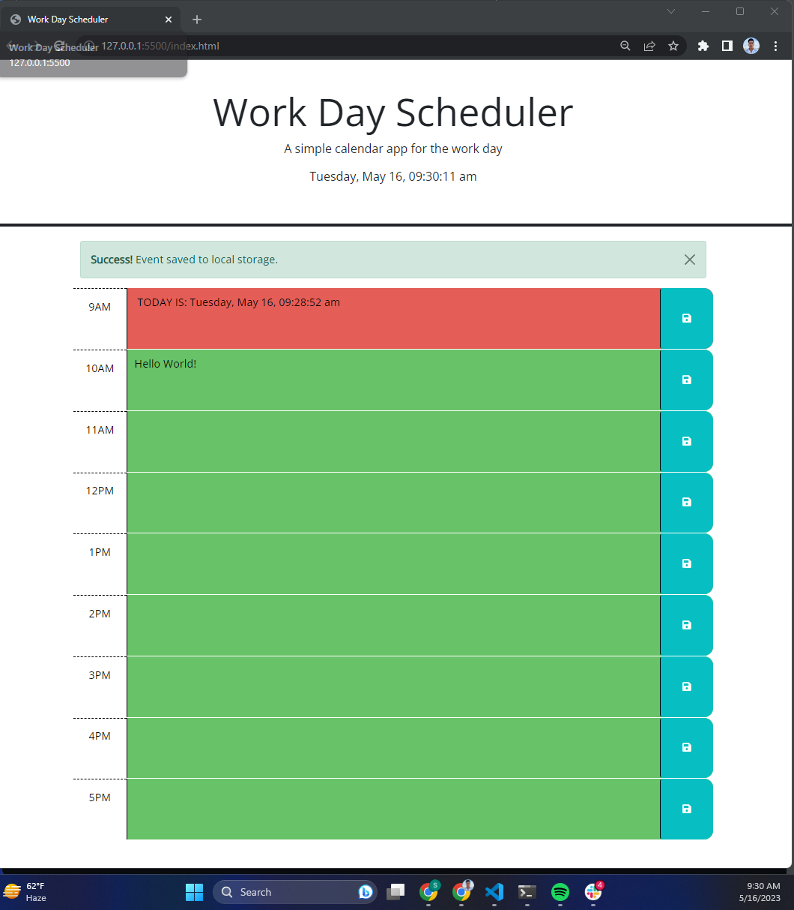

# 05 Third-Party APIs: Work Day Scheduler

## Description

Work Day Scheduler a simple calendar application that allows a user to save events for each hour of the day. 

This app will run in the browser and feature dynamically updated HTML and CSS powered by jQuery.

This app uses the Day.js library to work with date and time.

## Usage

Run the app in Live Server.
Add events to a time block and add text. Click the BLUE save button to save your entry.

## Screenshots

## Resources

* [jQuery API Docs](https://api.jquery.com/)

* [jQuery Event Delegation](https://learn.jquery.com/events/event-delegation/)

* [Bootstrap Docs](https://getbootstrap.com/docs/5.1/getting-started/introduction/)

* [Google Fonts Docs](https://fonts.google.com)

* [jQuery UI Docs](https://jqueryui.com/demos/)

* [Day.js Docs](https://day.js.org/docs/en/display/format)
